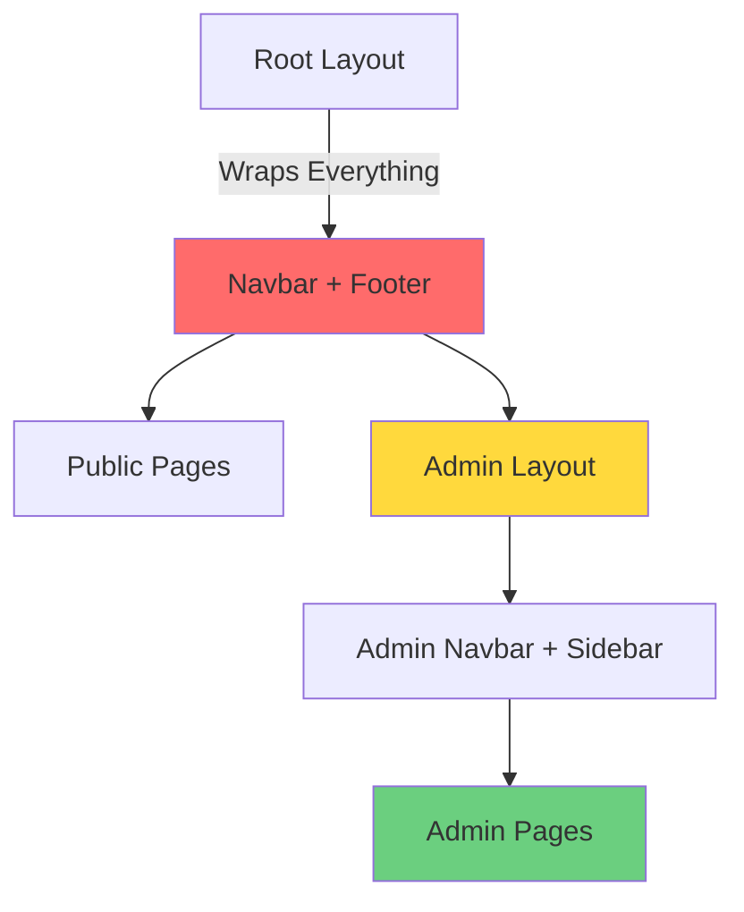
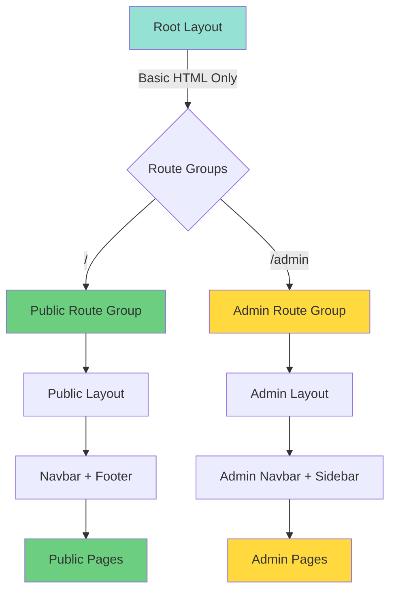

# Layout Separation Plan: Public vs Admin

## Problem Statement

Currently, the public [`Navbar`](../components/public/Navbar.tsx:1) and [`Footer`](../components/public/Footer.tsx:1) components are appearing on admin pages because they are included in the root [`app/layout.tsx`](../app/layout.tsx:1). The admin section has its own layout with [`Sidebar`](../components/admin/Sidebar.tsx:1) and [`AdminNavbar`](../components/admin/AdminNavbar.tsx:1), but the root layout's Navbar and Footer are still wrapping everything.

## Current Structure

```
app/
├── layout.tsx (Root - includes Navbar & Footer for ALL pages)
├── page.tsx (Home page)
├── globals.css
├── admin/
│   ├── layout.tsx (Admin layout with Sidebar & AdminNavbar)
│   ├── dashboard/page.tsx
│   ├── kontrak/page.tsx
│   ├── login/page.tsx
│   ├── pendaftar/page.tsx
│   ├── peserta/page.tsx
│   └── program/page.tsx
├── daftar/
│   └── page.tsx
└── paket/
    ├── page.tsx
    └── [slug]/page.tsx
```

### Current Issue Flow



**Problem**: Admin pages get BOTH public Navbar/Footer AND admin Navbar/Sidebar

## Proposed Solution

Use Next.js 13+ Route Groups to create separate layout contexts for public and admin sections.

### New Structure

```
app/
├── layout.tsx (Root - ONLY basic HTML structure, no Navbar/Footer)
├── globals.css
├── (public)/                    [NEW - Route Group]
│   ├── layout.tsx              [NEW - Public layout with Navbar & Footer]
│   ├── page.tsx                [MOVED from app/page.tsx]
│   ├── daftar/
│   │   └── page.tsx            [MOVED from app/daftar/page.tsx]
│   └── paket/
│       ├── page.tsx            [MOVED from app/paket/page.tsx]
│       └── [slug]/page.tsx     [MOVED from app/paket/[slug]/page.tsx]
└── admin/
    ├── layout.tsx (Admin layout - unchanged)
    ├── dashboard/page.tsx
    ├── kontrak/page.tsx
    ├── login/page.tsx
    ├── pendaftar/page.tsx
    ├── peserta/page.tsx
    └── program/page.tsx
```

### Proposed Solution Flow



**Solution**: Each section has its own isolated layout context

## Implementation Steps

### Step 1: Update Root Layout
**File**: [`app/layout.tsx`](../app/layout.tsx:1)

Remove Navbar and Footer imports and components. Keep only:
- Global CSS import
- Metadata
- Basic HTML structure (html, body tags)
- Font configuration

```typescript
import './globals.css';
import type { Metadata } from 'next';
import { Inter } from 'next/font/google';

const inter = Inter({ subsets: ['latin'] });

export const metadata: Metadata = {
  title: 'LPK Dua Berkah',
  description: 'Lembaga Pelatihan Kerja Dua Berkah - Menyediakan pelatihan vokasional berkualitas',
};

export default function RootLayout({
  children,
}: {
  children: React.ReactNode;
}) {
  return (
    <html lang="id">
      <body className={inter.className}>
        {children}
      </body>
    </html>
  );
}
```

### Step 2: Create Public Route Group
**Directory**: `app/(public)/`

Create a new directory with parentheses to create a route group. The parentheses mean the folder name won't appear in the URL.

### Step 3: Create Public Layout
**File**: `app/(public)/layout.tsx` [NEW]

Move Navbar and Footer logic here:

```typescript
import Navbar from '@/components/public/Navbar';
import Footer from '@/components/public/Footer';

export default function PublicLayout({
  children,
}: {
  children: React.ReactNode;
}) {
  return (
    <div className="flex flex-col min-h-screen">
      <Navbar />
      <main className="grow">{children}</main>
      <Footer />
    </div>
  );
}
```

### Step 4: Move Public Pages
Move the following files into the `(public)` route group:

1. **Home Page**
   - From: `app/page.tsx`
   - To: `app/(public)/page.tsx`

2. **Registration Page**
   - From: `app/daftar/page.tsx`
   - To: `app/(public)/daftar/page.tsx`

3. **Package Pages**
   - From: `app/paket/page.tsx`
   - To: `app/(public)/paket/page.tsx`
   - From: `app/paket/[slug]/page.tsx`
   - To: `app/(public)/paket/[slug]/page.tsx`

### Step 5: Verify Admin Layout
**File**: [`app/admin/layout.tsx`](../app/admin/layout.tsx:1)

No changes needed. This layout already has its own structure with Sidebar and AdminNavbar.

## Route Mapping

### Before (Current)
- `/` → Root Layout (Navbar + Footer) → Home Page
- `/daftar` → Root Layout (Navbar + Footer) → Registration Page
- `/paket` → Root Layout (Navbar + Footer) → Packages Page
- `/paket/[slug]` → Root Layout (Navbar + Footer) → Package Detail Page
- `/admin/*` → Root Layout (Navbar + Footer) → Admin Layout (Sidebar + AdminNavbar) → Admin Pages ❌

### After (Proposed)
- `/` → Root Layout → Public Layout (Navbar + Footer) → Home Page ✅
- `/daftar` → Root Layout → Public Layout (Navbar + Footer) → Registration Page ✅
- `/paket` → Root Layout → Public Layout (Navbar + Footer) → Packages Page ✅
- `/paket/[slug]` → Root Layout → Public Layout (Navbar + Footer) → Package Detail Page ✅
- `/admin/*` → Root Layout → Admin Layout (Sidebar + AdminNavbar) → Admin Pages ✅

## Benefits

1. **Clean Separation**: Public and admin sections are completely isolated
2. **No URL Changes**: Route groups don't affect URLs, so all existing links work
3. **Maintainable**: Each section has its own layout logic
4. **Scalable**: Easy to add more route groups in the future (e.g., `(auth)`, `(dashboard)`)
5. **Performance**: No unnecessary components rendered on admin pages

## Testing Checklist

After implementation, verify:

- [ ] Public pages (`/`, `/daftar`, `/paket`) show Navbar and Footer
- [ ] Admin pages (`/admin/*`) show ONLY Sidebar and AdminNavbar
- [ ] No public Navbar/Footer appears on admin pages
- [ ] All navigation links work correctly
- [ ] Styling is consistent across all pages
- [ ] Mobile responsive behavior works on both public and admin sections

## Rollback Plan

If issues occur:
1. Keep backup of original `app/layout.tsx`
2. Can quickly revert by moving files back to original locations
3. Delete `app/(public)` directory
4. Restore original root layout

## Additional Considerations

### Login Page
The [`app/admin/login/page.tsx`](../app/admin/login/page.tsx:1) is currently under `/admin/login`. Consider if this should:
- Stay in admin section (current)
- Move to a separate `(auth)` route group
- Have its own minimal layout without sidebar

### 404 and Error Pages
Consider creating:
- `app/(public)/not-found.tsx` for public 404s
- `app/admin/not-found.tsx` for admin 404s

## References

- [Next.js Route Groups Documentation](https://nextjs.org/docs/app/building-your-application/routing/route-groups)
- [Next.js Layouts Documentation](https://nextjs.org/docs/app/building-your-application/routing/pages-and-layouts)
